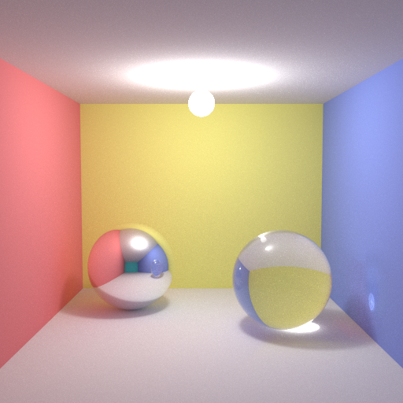

# pocketpt
A WebGPU path tracer in a single HTML file, inspired by [Reinhold Preiner's single-source GLSL path tracer in 111 lines of code](https://github.com/rpreiner/pocketpt), which itself is based on [Kevin Beason's smallpt](http://kevinbeason.com/smallpt). This project does not quite hit the sub 111 LOC target, but should remain quite readable at less than 485 LOC (WGSL), and less than 430 LOC (GLSL), respectively.

## Usage 

* Platform: 
    - Google Chrome Canary (with --enable-unsafe-webgpu)
    - may run on Firefox Nightly (about:config and dom.webgpu.enabled and gfx.webrender.all) with slight adjustments

* Run: 
    - Simply open the HTML file in your browser, and wait for the rendered image to appear. There is no need for a local HTTP server to circumvent CORS, since CSS, Javascript and WGSL/GLSL shaders are all embedded into the respective HTML files.
    - [Online Demo (GLSL)](https://htmlpreview.github.io/?https://github.com/pjhusky/pocketpt-webgpu/blob/main/pocketpt_webgpu_glsl_one_file.html)
    - [Online Demo (WGSL)](https://htmlpreview.github.io/?https://github.com/pjhusky/pocketpt-webgpu/blob/main/pocketpt_webgpu_wgsl_one_file.html)

* Adjust:
    - rendering resolution - search for "webgpu-canvas" and adjust its (max-)width/height attributes
    - samplesPerPixel - determines how many rays are traced per pixel (the more samples per pixel, the less noisy the result)
    - maxDepth - determines the maximum number of "bounces" per ray (default: 24)

## Implementation Notes

Due to WebGPU's lack of double-precision support, the walls that were originally made up of very large and distant spheres (so they appear locally flat), were replaced by simple planes, due to numerical imprecisions which would otherwise lead to rendering artifacts (surface acne).

In this project, WebGPU runs "headless" (without a "context window"), but for convenience the output buffer is read back from the GPU to the CPU and then displayed in the browser.

An internet connections is required for running the GLSL compute-shader version. The WGSL version will also work offline.

## 
Special thanks go to Reinhold Preiner, and of course Kevin Beason for publishing their respective path tracing source code, as well as to 
[Austin Eng's WebGPU Samples](https://austin-eng.com/webgpu-samples/), [Tarek Sherif's WebGPU Examples](https://github.com/tsherif/webgpu-examples), and [Surma's article 'WebGPU - All of the cores, none of the canvas'](https://surma.dev/things/webgpu/), which were invaluable resources to get this project up and running.

Also of interest:
* [Precision Improvements for Ray/Sphere Intersection by Eric Haines, Johannes Günther, and Thomas Akenine-Möller](https://library.oapen.org/viewer/web/viewer.html?file=/bitstream/handle/20.500.12657/22837/1007324.pdf?sequence=1&isAllowed=y).
* https://prideout.net/emulating-double-precision
* http://blog.hvidtfeldts.net/index.php/2012/07/double-precision-in-opengl-and-webgl/
* https://blog.cyclemap.link/2011-06-09-glsl-part2-emu/